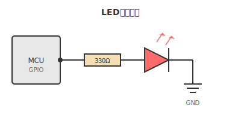

# 第3章 数式と図表

本章では、数式の記述方法と図の埋め込み方法を説明する。

## 数式の表現

### インライン数式

文中に数式を埋め込む場合、$E = mc^2$ のように記述する。二次方程式の解の公式は $x = \frac{-b \pm \sqrt{b^2 - 4ac}}{2a}$ である。

### ブロック数式

独立した数式は以下のように記述する。

$$
\int_{-\infty}^{\infty} e^{-x^2} dx = \sqrt{\pi}
$$

マクスウェル方程式:

$$
\nabla \cdot \mathbf{E} = \frac{\rho}{\varepsilon_0}
$$

$$
\nabla \cdot \mathbf{B} = 0
$$

$$
\nabla \times \mathbf{E} = -\frac{\partial \mathbf{B}}{\partial t}
$$

$$
\nabla \times \mathbf{B} = \mu_0 \mathbf{J} + \mu_0 \varepsilon_0 \frac{\partial \mathbf{E}}{\partial t}
$$

### 行列

$$
A = \begin{pmatrix}
a_{11} & a_{12} & a_{13} \\
a_{21} & a_{22} & a_{23} \\
a_{31} & a_{32} & a_{33}
\end{pmatrix}
$$

### 場合分け

$$
f(x) = \begin{cases}
x^2 & (x \geq 0) \\
-x^2 & (x < 0)
\end{cases}
$$

## 図の埋め込み

### SVG 図

以下は LED 点滅回路の概念図である。

### 複数の図

技術書では、手順を示すために複数の図を並べることがある。

## 図表の番号付け

技術書では図表に番号を付けて参照する。図や表の番号は CSS で自動的に付与されるため、Markdown では凡例テキストのみを記述すればよい。

## まとめ

本章では、数式の記述方法と図の埋め込み方法を説明した。数式は LaTeX 形式で記述し、図は SVG または PNG 形式で埋め込む。
